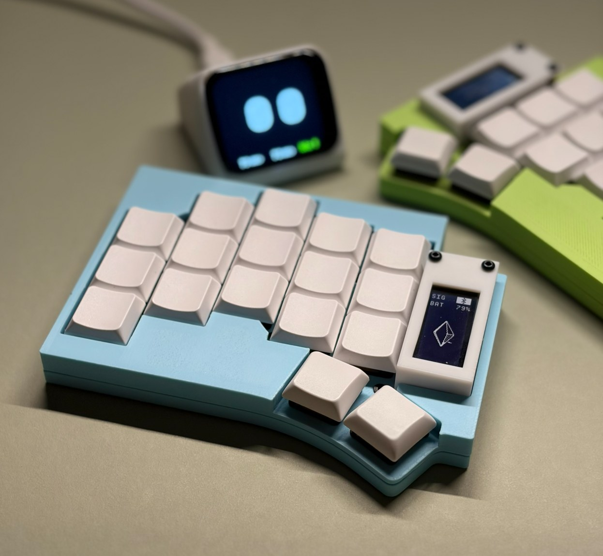

# urchin boxy case

A high-profile case: raised rim, with mountains between the keycaps. Four
printed parts per half, no supports.

Fits both the duckyb and the beekeeb PCB.

## Parts

- `urchin_boxy_top_right.stl` - switch plate and rim
- `urchin_boxy_mountains_right.stl` - raised pads between the keycaps
- `urchin_boxy_bottom_right.stl` - floor, standoffs and skirt
- `urchin_boxy_shield_right.stl` - screen shield over the MCU

Right half only - mirror in your slicer for the left. Mirror the top and the
mountains together, they share coordinates.

Assembled height is 11.88 mm.

## Printing

Print as oriented, no supports on any part: top on its plate underside, bottom
floor down, shield flat face down.

Load the mountains as a *part of the top*, not as a separate object - they span
z 3.8 to 8.88 and float if imported alone. In Bambu Studio: import the top,
then right-click it -> Add part -> Load and pick the mountains. They share
coordinates and align on import.

## Notes

On a beekeeb board there is no room for the JST socket under the plate. Remove
it and solder the battery to the pads directly. duckyb's design assumes direct
soldering, so it doesn't have this problem.

The plate is cut through over the duckyb reset button so it isn't held
down, but the button is not reachable - the mountains roof the hole.
Resetting means taking the top off.

The screen shield mounts on metal standoffs, not printed ones.

## Source

Built from OpenSCAD source at
[urchin-cuboid-case](https://github.com/rayreside/urchin-cuboid-case), MIT.

The raised rim and mountains form is inspired by [TOTEM](https://github.com/GEIGEIGEIST/TOTEM)
by GEIGEIGEIST and [Karma](https://github.com/achyudh/karma) by achyudh.
