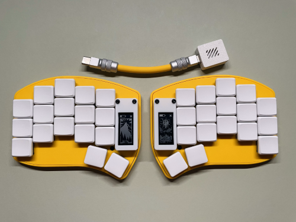
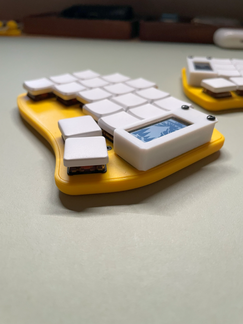

# urchin-case

This requires the beekeeb version of the urchin keyboard.

The battery would have to be soldered directly and put underneath the MCU, and the JST socket needs to be taken off.

No need to desolder the JST socket if you don't have a desoldering pump, I pried off mine and adjusted the case design to have some room for the remaining bits that I couldn't personally completely take off.

Please note that the screen shield hides the reset button completely.

