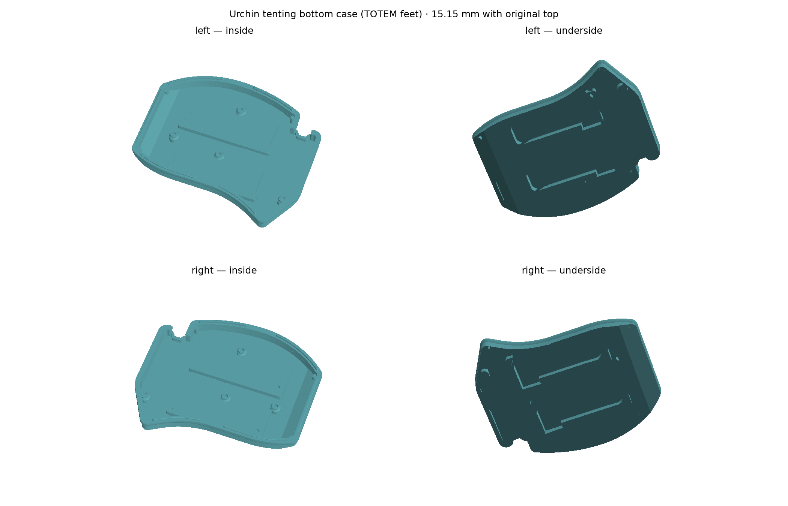

# Urchin tenting bottom (TOTEM feet)

A replacement bottom for the official Coral case that takes the same tenting
feet as the TOTEM tenting case (the AliExpress feet from #23). The Coral top
is used unchanged. A 40 × 20 × 4 mm (350 mAh) battery fits next to the feet.

## Parts

- `urchin_tenting_bottom_left.stl`
- `urchin_tenting_bottom_right.stl`

Each half has two foot pockets running east–west, so the halves tent towards
the middle. The right half is a mirror of the left, pockets included.

## Dimensions

- Bottom: 11.53 mm. With the Coral top: 15.15 mm (without feet, switches and keycaps).
- Floor 2 mm. Foot pockets 4.1 mm deep, roofed with 1.65 mm at the height of
  the original inner floor, so the electronics clearance is the same as in the
  original bottom.
- Outer bearing chamfer 21.1° like the TOTEM tenting bottom, 2 mm wall.
- Battery next to the feet: a 40 × 20 × 4 mm (350 mAh) pouch cell is in use
  in the printed revision. Cable and connector routing are not modelled.

## Hardware

- 2× TOTEM-style tenting feet per half
- The same screws as the original Coral case

## Printing

Print floor down, as oriented.

## Status

The previous revision of this bottom was printed and fits the Coral top and
the feet. This revision only closes two unintended thin slits next to the foot
pockets and is otherwise identical. It is verified in CAD (watertight, single
solid, manifold after binary STL export) but has not been printed yet.

The geometry is generated parametrically (CadQuery + trimesh) on top of the
original bottom mesh; the build scripts are not part of this repository.
