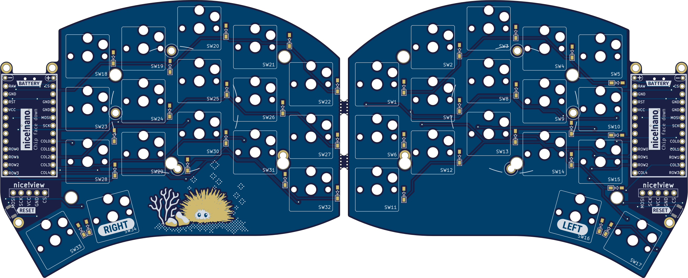

# Urchin

I created this design because I wanted to upgrade my [Sweep](https://github.com/davidphilipbarr/Sweep) with the fancy nice!view displays. I decided to use the edge design from the [Swoop](https://github.com/jimmerricks/swoop) and to make it compatible with Kailh hotswap sockets.  
**This is a strictly wireless-only design, and is only compatible with ZMK / nice!nano.**

> Q: Why is this not just another Sweep?  
*A: In order to support the nice!view display I had to use a switch matrix with diodes instead of the Sweep's direct pin design. This means that the firmwares are not interchangeable. I also wanted to use a different PCB shape which makes it incompatible with Sweep cases.*

**If you enjoy my work, please consider ⭐ starring and/or ❤ sponsoring it.**

## Features
- [x] Design fully optimized for wireless    
- [x] Native nice!view support  
- [x] Familiar Ferris/Sweep layout  
- [x] Improved outline shape  
- [x] Support for Kailh hotswap sockets  
- [x] Mounting points for cases

### Upcoming
- [ ] Plate file
- [ ] MCU Cover file
- [ ] Tray case 3D model
- [ ] Changes to diode footprint and position

## Part list (for both sides)
#### Required
- 34× Kailh **CHOC** Hotswap Sockets
- 34× Kailh Choc v1 Switches
- 34× Keycaps
- 34× SMD diodes (SOD-123)
- 2× nice!nano
- 2× Lipo battery (301230)
- 48× mill-max machined pins
- 2× Pair of female headers
#### Optional
- 2× nice!view
- 2× Reset switch (B3U-1000P(M))
- 2× Power switch (MSK 12C02)
- 10× adhesive silicone feet

## How do I make this?

*Video guide coming soon.*

[comment]: 

## Firmware
Urchin supports ZMK only. To get started with ZMK visit the [zmk-urchin repository](https://github.com/duckyb/zmk-urchin) and follow the provided instructions.

## Credits
- PCB edge design by [jimmerricks](https://github.com/jimmerricks/swoop)
- Coral, rocks, sand & bubbles by [Kneecrust](https://linktr.ee/kneecrust)
- The development name "Swipe Light" by [Pete](https://github.com/petejohanson)
- Nice!view integration reference: [sadekbaroudi/sweep36](https://github.com/sadekbaroudi/sweep36)
- ZMK Firmware help by [Mabroum](https://github.com/AlaaSaadAbdo)
- Silkscreen labels style: [bastardkb/dilemma](https://github.com/Bastardkb/Dilemma)
