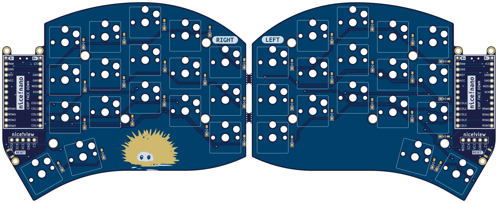

# Swipe Light

I created this design because I wanted to upgrade my [Sweep](https://github.com/davidphilipbarr/Sweep) with the fancy nice!view displays. I decided to use the edge design from the [Swoop](https://github.com/jimmerricks/swoop) and to make it compatible with Kailh hotswap sockets.  
**This is a strictly wireless-only design, and is only compatible with ZMK / nice!nano.**

> Q: Why is this not just another Sweep?  
*A: In order to support the nice!view display I had to use a switch matrix with diodes instead of the Sweep's direct pin design. This means that the firmwares are not interchangeable. I also wanted to use a different PCB shape which makes it incompatible with Sweep cases.*

## Features
⭕ Design fully optimized for wireless    
⭕ Native nice!view support  
⭕ Familiar Ferris/Sweep layout  
⭕ Improved outline shape  
⭕ Support for Kailh hotswap sockets  

## Part list (for both sides)
#### Required
- 34× Kailh **CHOC** Hotswap Sockets
- 34× Kailh Choc v1 Switches
- 34× Keycaps
- 34× SMD diodes (SOD-123)
- 2× nice!nano
- 2× Lipo battery (301230)
- 48× mill-max machined pins
- 2× Pair of female headers
#### Optional
- 2× nice!view
- 2× Reset switch (B3U-1000P(M))
- 10× adhesive silicone feet

## Credits
- The name "Swipe Light" by [Pete](https://github.com/petejohanson)
- PCB edge design by [jimmerricks](https://github.com/jimmerricks/swoop)
- nice!view integration reference: [sadekbaroudi/sweep36](https://github.com/sadekbaroudi/sweep36)
- silkscreen labels style: [bastardkb/dilemma](https://github.com/Bastardkb/Dilemma)
